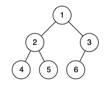

Given the `root` of a binary tree, determine if it is a *complete binary tree*.

In a **[complete binary tree](http://en.wikipedia.org/wiki/Binary_tree#Types_of_binary_trees)**, every level, except possibly the last, is completely filled, and all nodes in the last level are as far left as possible. It can have between `1` and `2h` nodes inclusive at the last level `h`.

 

**Example 1:**



```
Input: root = [1,2,3,4,5,6]
Output: true
Explanation: Every level before the last is full (ie. levels with node-values {1} and {2, 3}), and all nodes in the last level ({4, 5, 6}) are as far left as possible.
```

**Example 2:**


```
Input: root = [1,2,3,4,5,null,7]
Output: false
Explanation: The node with value 7 isn't as far left as possible.
```

 

**Constraints:**

- The number of nodes in the tree is in the range `[1, 100]`.
- `1 <= Node.val <= 1000`

# solution

```java
/**
 * Definition for a binary tree node.
 * public class TreeNode {
 *     int val;
 *     TreeNode left;
 *     TreeNode right;
 *     TreeNode() {}
 *     TreeNode(int val) { this.val = val; }
 *     TreeNode(int val, TreeNode left, TreeNode right) {
 *         this.val = val;
 *         this.left = left;
 *         this.right = right;
 *     }
 * }
 */
class Solution {
    public boolean isCompleteTree(TreeNode root) {
        if (root == null) {
            return true;
        }
        int l=0, r=0;
        ArrayList<TreeNode> arr = new ArrayList<>();
        boolean leaf = false;

        arr.add(root);
        r++;
        while (l < r) {
            int size = r - l;
            for (int i=0; i<size; i++) {
                TreeNode cur = arr.get(l);
                l++;
                if (cur.left == null && cur.right != null) {
                    return false;
                }
                if (leaf && (cur.left != null || cur.right != null)) {
                    return false;
                }

                if (cur.left != null) {
                    arr.add(cur.left);
                    r++;
                }
                if (cur.right != null) {
                    arr.add(cur.right);
                    r++;
                }
                if (cur.left == null || cur.right == null) {
                    leaf = true;
                }
            }
        }
        return true;
    }
}
```

